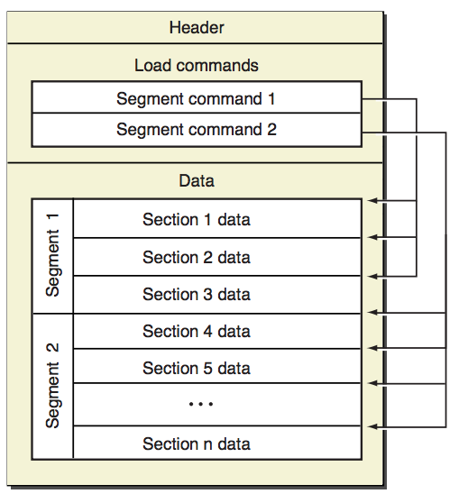

# nm_otool

Information on Mach-O architecture files.
* nm - display name list (symbol table)
* otool - object file displaying tool

```rtfm
man nm; man otool
```

# Description

|Program       |Load commands |Segment Name |
|--------------|--------------|-------------|
|```nm```      |LC_SYMTAB     |             |
|```otool -t```|LC_SEGMENT_64 | __TEXT      |

##  Header and Magic

### ```magic``` number
```c
#define MH_MAGIC    0xfeedface    /* the mach magic number */
#define MH_CIGAM    0xcefaedfe    /* NXSwapInt(MH_MAGIC) */
#define MH_MAGIC_64 0xfeedfacf    /* the 64-bit mach magic number */
#define MH_CIGAM_64 0xcffaedfe    /* NXSwapInt(MH_MAGIC_64) */
#define FAT_MAGIC   0xcafebabe    /* the fat magic number */
#define FAT_CIGAM   0xbebafeca    /* NXSwapLong(FAT_MAGIC) */
```

### ```mach_header``` and ```load_command```
```c
struct mach_header:             /* struct mach_header_64 for 64-bit */
    uint32_t        magic;      /* mach magic number identifier */
    cpu_type_t      cputype;    /* cpu specifier */
    cpu_subtype_t   cpusubtype; /* machine specifier */
    uint32_t        filetype;   /* type of file */
    uint32_t        ncmds;      /* number of load commands */
    uint32_t        sizeofcmds; /* the size of all the load commands */
    uint32_t        flags;      /* flags */
_64 uint32_t        reserved;   /* reserved */

struct load_command:            /* load_command header */
    uint32_t        cmd;        /* type of load command */
    uint32_t        cmdsize;    /* total size of command in bytes */
```

##  Segments and Sections



### ```segment_command``` load_command
```c
struct segment_command:          /* struct segment_command_64 for 64-bit */
    uint32_t        cmd;         /* LC_SEGMENT or LC_SEGMENT_64 */
    uint32_t        cmdsize;     /* includes sizeof section structs */
    char            segname[16]; /* segment name */
_32 uint32_t        vmaddr;      /* memory address of this segment */
_32 uint32_t        vmsize;      /* memory size of this segment */
_32 uint32_t        fileoff;     /* file offset of this segment */
_32 uint32_t        filesize;    /* amount to map from the file */
_64 uint64_t        vmaddr;      /* memory address of this segment */
_64 uint64_t        vmsize;      /* memory size of this segment */
_64 uint64_t        fileoff;     /* file offset of this segment */
_64 uint64_t        filesize;    /* amount to map from the file */
    vm_prot_t       maxprot;     /* maximum VM protection */
    vm_prot_t       initprot;    /* initial VM protection */
    uint32_t        nsects;      /* number of sections in segment */
    uint32_t        flags;       /* flags */
```

### ```section``` contained in a segment
```c
struct section:                   /* struct section_64 for 64-bit */
    char            sectname[16]; /* name of this section */
    char            segname[16];  /* segment this section goes in */
_64 uint64_t        addr;         /* for 64-bit memory address of this section */
_64 uint64_t        size;         /* for 64-bit size in bytes of this section */
_32 uint32_t        addr;         /* for 32-bit memory address of this section */
_32 uint32_t        size;         /* for 32-bit size in bytes of this section */
    uint32_t        offset;       /* file offset of this section */
    uint32_t        align;        /* section alignment (power of 2) */
    uint32_t        reloff;       /* file offset of relocation entries */
    uint32_t        nreloc;       /* number of relocation entries */
    uint32_t        flags;        /* flags (section type and attributes)*/
    uint32_t        reserved1;    /* reserved (for offset or index) */
    uint32_t        reserved2;    /* reserved (for count or sizeof) */
_64 uint32_t        reserved3;    /* reserved */
```

##  Symbols Segments

### ```symtab_command``` load_command
```c
struct symtab_command:
    uint32_t        cmd;        /* LC_SYMTAB */
    uint32_t        cmdsize;    /* sizeof(struct symtab_command) */
    uint32_t        symoff;     /* symbol table offset (nlist array) */
    uint32_t        nsyms;      /* number of symbol table entries */
    uint32_t        stroff;     /* string table offset */
    uint32_t        strsize;    /* string table size in bytes */
```

### Symbol ```nlist```
```c
struct nlist:                   /* struct nlist_64 for 64-bit */
    union           n_un:       /* union with char *n_name for 32-bit */
        uint32_t    n_strx;     /* index into the string table (union n_un) */
    uint8_t         n_type;     /* type flag, see below */
    uint8_t         n_sect;     /* section number or NO_SECT */
    int16_t         n_desc;     /* see <mach-o/stab.h> */
_32 uint32_t        n_value;    /* value of this symbol (or stab offset) */
_64 uint64_t        n_value;    /* value of this symbol (or stab offset) */
```

### Symbol Types

|**Printed char**       |```U```|```A```|```T```|```D```|```B```|```C```|```-```|```S```|```I```|
|-----------------------|-------|-------|-------|-------|-------|-------|-------|-------|-------|
|**Symbol Type**|undefined|absolute|text section symbol|data section  symbol|bss section symbol|common symbol|debugger symbols|symbol in another section|indirect symbol|

* Symbol Section obtained by checking the ```nlist.n_sect``` section's ```section.sectname``` (see section picture above)
* Additional Symbol Type info are in ```nlist.n_type```
    * If the symbol is local (non-external == ```N_EXT``` bit on), the symbol's type is instead represented by  the  corresponding lowercase  letter
    * A lower case u in a dynamic shared library indicates a undefined reference to a private external in another module in the same library

```c
/*
** The n_type field really contains four fields:
** unsigned char [N_STAB:3 | N_PEXT:1 | N_TYPE:3 | N_EXT:1]
** which are used via the following masks
*/
#define N_STAB  0xe0            /* if any of these bits set, a symbolic debugging entry */
#define N_PEXT  0x10            /* private external symbol bit */
#define N_TYPE  0x0e            /* mask for the type bits */
#define N_EXT   0x01            /* external symbol bit, set for external symbols */

/* Values for N_TYPE bits of the n_type field */
#define N_UNDF  0x0             /* undefined, n_sect == NO_SECT */
#define N_ABS   0x2             /* absolute, n_sect == NO_SECT */
#define N_SECT  0xe             /* defined in section number n_sect */
#define N_PBUD  0xc             /* prebound undefined (defined in a dylib) */
#define N_INDR  0xa             /* indirect */
```
